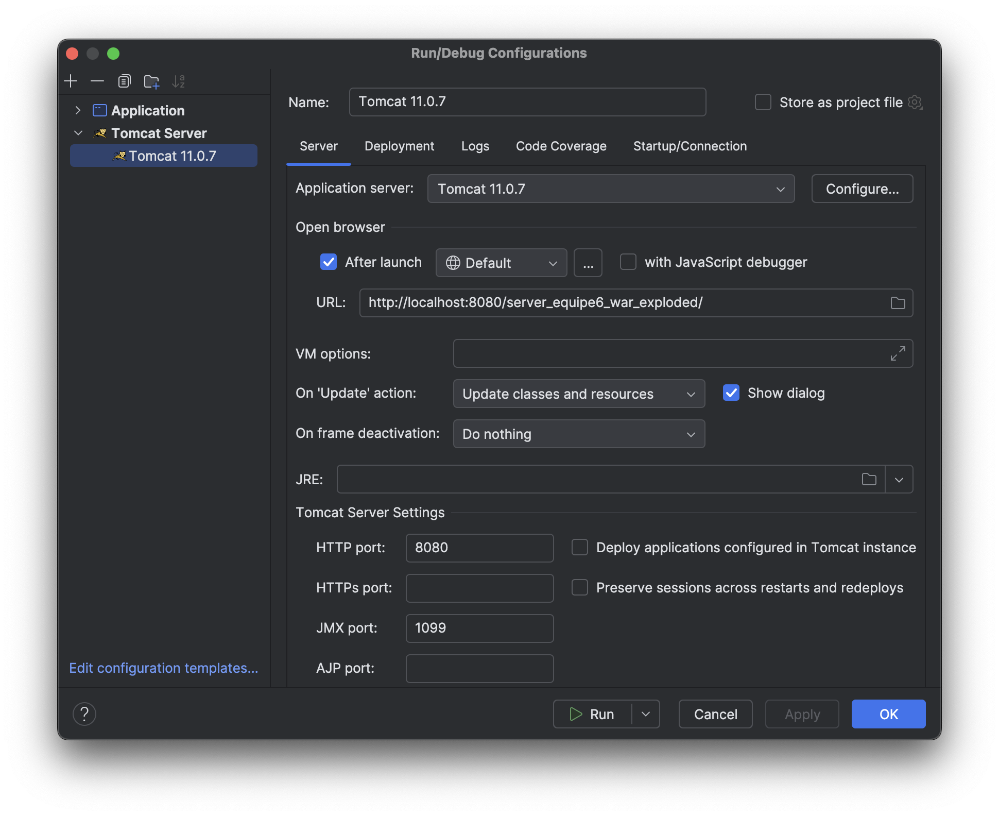

# LOG660 - Équipe 6 - Java Server

Built using:
- **JAX-RS (Jersey)** for RESTful services
- **Hibernate** for ORM
- **Maven** for dependency management
- **Oracle DB** for persistent storage

---

## 🚀 Prerequisites

Make sure you have the following installed:

- **Java 21** (or compatible JDK)
- **Apache Maven 3.8+**
- **Oracle Database Access** (ETS instance or local)
- **ojdbc11 driver** manually installed in your local Maven repository

---

## 🧩 ojdbc Setup

Oracle JDBC driver (`ojdbc11.jar`) is not available on Maven Central, so you must install it manually:

1. Download `ojdbc11.jar` from [Oracle's official website](https://www.oracle.com/database/technologies/appdev/jdbc-downloads.html).
2. Run the following command in terminal to install it into your local Maven repository:

```bash
mvn install:install-file \
  -Dfile=/path/to/ojdbc11.jar \
  -DgroupId=com.oracle.database.jdbc \
  -DartifactId=ojdbc11 \
  -Dversion=21.9.0.0 \
  -Dpackaging=jar

```
---
## Running the Web App via Tomcat in IntelliJ
1. Open the project in IntelliJ IDEA

2. Start by building the project:
   - Go to **View > Tool Windows > Maven**
   - In the Maven tool window, click on the **Lifecycle** tab
   - Run `clean` and then `install`
   - Run `clean`and then `package` to create the WAR file

3. Go to Run > Edit Configurations

4. Add a new Tomcat Server > Local configuration

5. Set deployment to Artifact > LOG660-Equipe6-Server:war exploded

6. Set context path to /server_equipe6_war_exploded

7. Run ▶️

8. Visit: http://localhost:8080/server_equipe6_war_exploded/api/films


